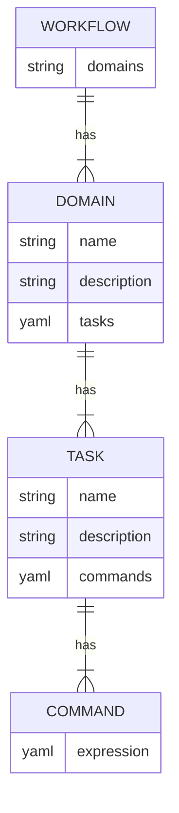
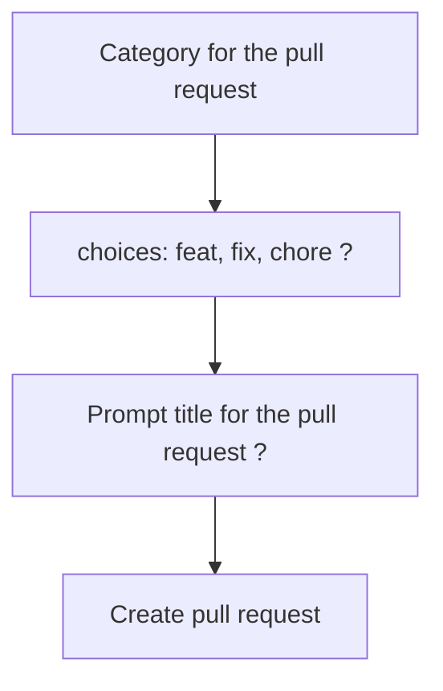

# Usage

This CLI runs on Node.js ≥ 22 (listr2 v9 requires ≥ 20). Some workflows call
external tools (Biome, `gh`, typedoc, pest); ensure those are available when
invoking related tasks. For an architectural overview, see
`CODE_ANALYSIS.md`.

## Overview

The `baldrick-broth.yaml` YAML file for a task tool consists of two main
sections: model and workflows. The model section defines a model that is
specific to the user and the project, such as the name, description, version,
dependencies, etc. The workflows section defines one or more domains that
represent different areas of functionality or responsibility in the project,
such as testing, deployment, documentation, etc. Each domain has a name and a
description that briefly explains its purpose.

Within each domain, there are one or more tasks that represent jobs that can
be executed in the terminal. Each task has a name and a description that
briefly explains what it does. Each task also has one or more commands that
specify the actual commands that run in the terminal when the task is
invoked. The commands can be simple strings or complex expressions that use
variables, operators, functions, etc, using a specific YAML syntax.

Note: The bundled workflow `test all` runs lint, unit tests, pest acceptance
tests, coverage, and a final TypeScript build step.



## Workflows

### Simple task

Here are some steps you can follow to write a command:

1.  Create a `baldrick-broth.yaml` file at the root of your project.

2.  Start by defining a workflow that describes the tasks you want to
    perform.

3.  Define a task that describes the command you want to run.

4.  Define a command that describes the specific command you want to run.

5.  Add any additional parameters or options that are required for your
    command.

Here’s an example of how you could write a command in YAML:

```yaml
workflows:
  test:
    # Use a descriptive title for your workflow
    title: Test the library
    # Provide a brief description of what your workflow does
    description: Test the library for defects
    tasks:
      jest:
        # Use a descriptive title for your task
        title: Run the unit tests with Jest
        # Provide a detailed description of what your task does
        description: Use the Jest framework to run unit tests
        # Explain why this task is important
        motivation: Detect weaknesses early
        # Include any relevant links that might be helpful for users
        links:
          - title: Jest is a JavaScript Testing Framework
            url: https://jestjs.io/
        main:
          commands:
            - title: Test all test files in test folder
              # Use a descriptive command name
              run: yarn jest
            - title: Test all test files in demo folder
              run: yarn jest demo/
```

Good practices:

-   Use descriptive titles and descriptions for your workflows and tasks.
-   Explain why each workflow and task is important.
-   Include any relevant links that might be helpful for users.
-   Use descriptive command names.
-   Provide detailed descriptions of what each command does.

### Task Conditional logic

To add conditional logic in YAML, you can use an if statement inside of your
build task list. Here’s an example of how you could add conditional logic to
your YAML file:

```YAML
- name: has-pest-files
  title: Check if there are any pest files
  run: find . -type f -name *.pest.yaml
  onSuccess:
    - save
    - silent
- a: every-truthy
  name: should-run-pest
  title: Is this a PR and is there some pest files
  values:
    - data.has-pest-files
    - runtime.parameters.pullRequest
- name: pest
  title: Run the integration pest tests
  if: data.should-run-pest
  run: npx baldrick-broth@latest test pest
```

In this example, the if attribute checks the boolean value of the variable in
the context and runs the pest step only if it’s true.

The benefits of being able to add conditional logic include:

-   More control over your build process.
-   The ability to run certain steps only when certain conditions are met.
-   The ability to skip certain steps when they’re not needed.

A list of functions that are supported:

| Name         | Title                                            | Other fields                                                                                                                                                                                                                                                                                                 |
| ------------ | ------------------------------------------------ | ------------------------------------------------------------------------------------------------------------------------------------------------------------------------------------------------------------------------------------------------------------------------------------------------------------ |
| get-property | Get a property using a dot prop path             |                                                                                                                                                                                                                                                                                                              |
| string-array | Process on a list of strings                     | Options for the transforming the resulting array of string with either: sort: Sorts the array of strings in ascending order. unique: Removes any duplicate strings from the array. filled: Removes any empty or undefined elements from the array. reverse: Reverses the order of the elements in the array. |
| concat-array | Concatenate several arrays together              |                                                                                                                                                                                                                                                                                                              |
| split-string | Split a string into multiple strings             | A separator to split the string                                                                                                                                                                                                                                                                              |
| split-lines  | Split a string into multiple lines               |                                                                                                                                                                                                                                                                                                              |
| some-truthy  | Return true if at least one of values is truthy  |                                                                                                                                                                                                                                                                                                              |
| some-falsy   | Return true if at least one of values is falsy   |                                                                                                                                                                                                                                                                                                              |
| every-truthy | Return true if all the values are truthy         |                                                                                                                                                                                                                                                                                                              |
| every-falsy  | Return true if all the values are falsy          |                                                                                                                                                                                                                                                                                                              |
| not          | Return the opposite boolean value                |                                                                                                                                                                                                                                                                                                              |
| range        | Generate a range of numbers                      | The number to start the range with, The number at the end of the range, A step to increment the range, usually 1                                                                                                                                                                                             |
| invert-title | Invert keys and values into a new title          |                                                                                                                                                                                                                                                                                                              |
| mask-title   | Uses JSON mask to select parts of the json title | JSON mask to select parts of the json title                                                                                                                                                                                                                                                                  |

### Interactive task

Interactive prompts provide a better user experience by guiding users through
a series of questions and options instead of requiring them to remember
complex commands or syntax.

This can help reduce errors by validating user input and providing feedback
when input is invalid.

Interactive prompts can help increase productivity by automating repetitive
tasks and reducing the time required to perform complex tasks.

Prompts in this CLI are powered by listr2 v9 with the Enquirer adapter.
Ensure `enquirer` is installed.

Let's dive into an example.

This code is describing a task that creates a pull request for a project. The
task has two parts: “Classify the pull request” and “Create the pull
request”.



```YAML
pr:
  title: Pull request for the project
  description: Create a pull request for the branch
  motivation: Automate the body of pull request
  main:
    commands:
      - a: prompt-choices
        name: category
        title: Category for the pull request
        message: Classify the pull request
        choices:
          - feat
          - fix
          - chore
          - docs
          - style
          - refactor
      - a: prompt-input
        name: title
        title: Title for the pull request
        description: A short title used for the pull request
        message: Short title describing the pull request
      - run: gh pr create --title {{escapeSpace _.category}}:{{escapeSpace
_.title}} --body-file temp/pull_request_relevant.md
        title: Create the pull request
```

The first part of the task has a prompt-choices command that asks the user to
classify the pull request into one of these categories: feat, fix, chore,
docs, style, refactor. Then it has a prompt-input command that asks the user
to provide a short title for the pull request.

The second part of the task has a run command that creates the pull request
with a title that concatenates category and title provided by user separated
by colon and space. The body of the pull request is then stored in
temp/pull\_request\_relevant.md file.

As a developer, you have several options for prompting users within your
code:

-   For simple string input, you can use `prompt-input`, which takes user
    input and returns a string. You can customize the prompt with a short
    message to guide the user.

-   If you need a yes/no or true/false answer, you can use
    `prompt-confirm`. This prompt will return a boolean value based on the
    user's response. Again, you can add a message to prompt the user with a
    more specific question.

-   For password or sensitive data, you can use `prompt-password`, which
    masks the user's input with asterisks or other symbols. Like the other
    prompts, you can include a message to guide the user.

-   If you want the user to choose from a list of options, you can use
    `prompt-select`. This prompt will display a list of choices and return
    the user's selection. You can include a short message to guide the user
    and a select statement to determine when the prompt should appear.

-   Finally, if you want the user to choose from a set of predefined
    options, you can use `prompt-choices`. This prompt will display a list
    of choices and return the user's selection. Once again, you can include
    a message to prompt the user to make a choice.

## Custom model

As a developer, you have the ability to create a custom model in YAML format
that can be utilized by tasks.
The model will be available in the task context under `build.model`.

```yaml
model:
  project:
    title: Build automation tool and task runner
    description:
      Take your developer workflow to the next level with a custom CLI
      with relevant documentation for running your task
    version: 0.14.0
    keywords:
      - CLI
      - Task runner
      - Build system
      - Build tool
      - Make
```

In the example above, the project version can then be referenced in your
build process using the dot path `build.model.project.version` or with
`{{build.model.project.version}}` in `run` shell commands (handlebars
templates).

[dot-prop](https://github.com/sindresorhus/dot-prop) is a library for
accessing nested JavaScript objects using a string path. It allows you to
access deeply nested properties without checking if each level of the object
exists.

[Handlebars](https://handlebarsjs.com/) is a simple templating language that
allows, in this case, to generate a command using a template and the task
context. Handlebars templates look like regular text with embedded Handlebars
expressions:

-   `{{expression}}`: This is used to insert dynamic values into templates
    using curly braces.
-   `{{#each}} {{/each}}`: This is used to loop through an array and
    display each item.
-   `{{#if}} {{/if}}`: This is used to conditionally render a block of
    content.
-   `{{!-- comment --}}`: This is used to write comments in your templates.
-   \`\`\`{{escapeSpace \_.title}}\`: render the title from the context but
    escape the spaces.

## Visual Studio code

[YAML Language Support by Red
Hat](https://marketplace.visualstudio.com/items?itemName=redhat.vscode-yaml)
is an extension that provides comprehensive YAML language support to Visual
Studio Code, via the yaml-language-server.

It uses JSON Schemas to understand the shape of a YAML file, including its
value sets, defaults and descriptions.
It offers features such as YAML validation, document outlining, auto
completion, hover support and formatter.
Auto completion and hover support are provided by the schema, so if a json
schema exists for a YAML file, the extension can suggest possible values and
show descriptions for each node.

You can set it up for `baldrick-broth` by adding the following code in your
visual code studio settings:

```json

"yaml.schemas": {
  "https://raw.githubusercontent.com/flarebyte/baldrick-broth/main/spec/snapshots/build-model/get-schema--schema.json": "*/baldrick-broth.yaml"
    },
```
