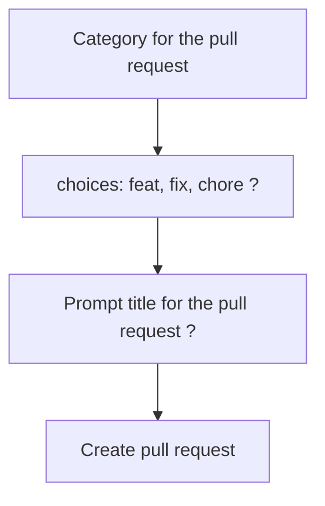

# Usage

## Workflows

### Simple task

Here are some steps you can follow to write a command:

1.  Create a `baldrick-broth.yaml` file at the root of your project.

2.  Start by defining a workflow that describes the tasks you want to
    perform.

3.  Define a task that describes the command you want to run.

4.  Define a command that describes the specific command you want to run.

5.  Add any additional parameters or options that are required for your
    command.

Here’s an example of how you could write a command in YAML:

```yaml
workflows:
  test:
    # Use a descriptive title for your workflow
    title: Test the library
    # Provide a brief description of what your workflow does
    description: Test the library for defects
    tasks:
      jest:
        # Use a descriptive title for your task
        title: Run the unit tests with Jest
        # Provide a detailed description of what your task does
        description: Use the Jest framework to run unit tests
        # Explain why this task is important
        motivation: Detect weaknesses early
        # Include any relevant links that might be helpful for users
        links:
          - title: Jest is a JavaScript Testing Framework
            url: https://jestjs.io/
        main:
          commands:
            - title: Test all test files in test folder
              # Use a descriptive command name
              run: yarn jest
            - title: Test all test files in demo folder
              run: yarn jest demo/
```

Good practices:

-   Use descriptive titles and descriptions for your workflows and tasks.
-   Explain why each workflow and task is important.
-   Include any relevant links that might be helpful for users.
-   Use descriptive command names.
-   Provide detailed descriptions of what each command does.

### Task Conditional logic

To add conditional logic in YAML, you can use an if statement inside of your
build task list. Here’s an example of how you could add conditional logic to
your YAML file:

```YAML
- name: has-pest-files
  title: Check if there are any pest files
  run: find . -type f -name *.pest.yaml
  onSuccess:
    - save
    - silent
- a: every-truthy
  name: should-run-pest
  title: Is this a PR and is there some pest files
  values:
    - data.has-pest-files
    - runtime.parameters.pullRequest
- name: pest
  title: Run the integration pest tests
  if: data.should-run-pest
  run: npx baldrick-broth@latest test pest
```

In this example, the if attribute checks the boolean value of the variable in
the context and runs the pest step only if it’s true.

The benefits of being able to add conditional logic include:

-   More control over your build process.
-   The ability to run certain steps only when certain conditions are met.
-   The ability to skip certain steps when they’re not needed.

A list of functions that are supported:

| Name         | Title                                            | Other fields                                                                                                                                                                                                                                                                                                 |
| ------------ | ------------------------------------------------ | ------------------------------------------------------------------------------------------------------------------------------------------------------------------------------------------------------------------------------------------------------------------------------------------------------------ |
| get-property | Get a property using a dot prop path             |                                                                                                                                                                                                                                                                                                              |
| string-array | Process on a list of strings                     | Options for the transforming the resulting array of string with either: sort: Sorts the array of strings in ascending order. unique: Removes any duplicate strings from the array. filled: Removes any empty or undefined elements from the array. reverse: Reverses the order of the elements in the array. |
| concat-array | Concatenate several arrays together              |                                                                                                                                                                                                                                                                                                              |
| split-string | Split a string into multiple strings             | A separator to split the string                                                                                                                                                                                                                                                                              |
| split-lines  | Split a string into multiple lines               |                                                                                                                                                                                                                                                                                                              |
| some-truthy  | Return true if at least one of values is truthy  |                                                                                                                                                                                                                                                                                                              |
| some-falsy   | Return true if at least one of values is falsy   |                                                                                                                                                                                                                                                                                                              |
| every-truthy | Return true if all the values are truthy         |                                                                                                                                                                                                                                                                                                              |
| every-falsy  | Return true if all the values are falsy          |                                                                                                                                                                                                                                                                                                              |
| not          | Return the opposite boolean value                |                                                                                                                                                                                                                                                                                                              |
| range        | Generate a range of numbers                      | The number to start the range with, The number at the end of the range, A step to increment the range, usually 1                                                                                                                                                                                             |
| invert-title | Invert keys and values into a new title          |                                                                                                                                                                                                                                                                                                              |
| mask-title   | Uses JSON mask to select parts of the json title | JSON mask to select parts of the json title                                                                                                                                                                                                                                                                  |

### Interactive task

Interactive prompts provide a better user experience by guiding users through a series of questions and options instead of requiring them to remember complex commands or syntax.

This can help reduce errors by validating user input and providing feedback when input is invalid.

Interactive prompts can help increase productivity by automating repetitive tasks and reducing the time required to perform complex tasks.


Let's dive into an example.

This code is describing a task that creates a pull request for a project. The task has two parts: “Classify the pull request” and “Create the pull request”.



```YAML
pr:
  title: Pull request for the project
  description: Create a pull request for the branch
  motivation: Automate the body of pull request
  main:
    commands:
      - a: prompt-choices
        name: category
        title: Category for the pull request
        message: Classify the pull request
        choices:
          - feat
          - fix
          - chore
          - docs
          - style
          - refactor
      - a: prompt-input
        name: title
        title: Title for the pull request
        description: A short title used for the pull request
        message: Short title describing the pull request
      - run: gh pr create --title {{escapeSpace _.category}}:{{escapeSpace _.title}} --body-file temp/pull_request_relevant.md
        title: Create the pull request
```

The first part of the task has a prompt-choices command that asks the user to classify the pull request into one of these categories: feat, fix, chore, docs, style, refactor. Then it has a prompt-input command that asks the user to provide a short title for the pull request.

The second part of the task has a run command that creates the pull request with a title that concatenates category and title provided by user separated by colon and space. The body of the pull request is then stored in temp/pull_request_relevant.md file.

As a developer, you have several options for prompting users within your code:

- For simple string input, you can use `prompt-input`, which takes user input and returns a string. You can customize the prompt with a short message to guide the user.

- If you need a yes/no or true/false answer, you can use `prompt-confirm`. This prompt will return a boolean value based on the user's response. Again, you can add a message to prompt the user with a more specific question.

- For password or sensitive data, you can use `prompt-password`, which masks the user's input with asterisks or other symbols. Like the other prompts, you can include a message to guide the user.

- If you want the user to choose from a list of options, you can use `prompt-select`. This prompt will display a list of choices and return the user's selection. You can include a short message to guide the user and a select statement to determine when the prompt should appear.

- Finally, if you want the user to choose from a set of predefined options, you can use `prompt-choices`. This prompt will display a list of choices and return the user's selection. Once again, you can include a message to prompt the user to make a choice.